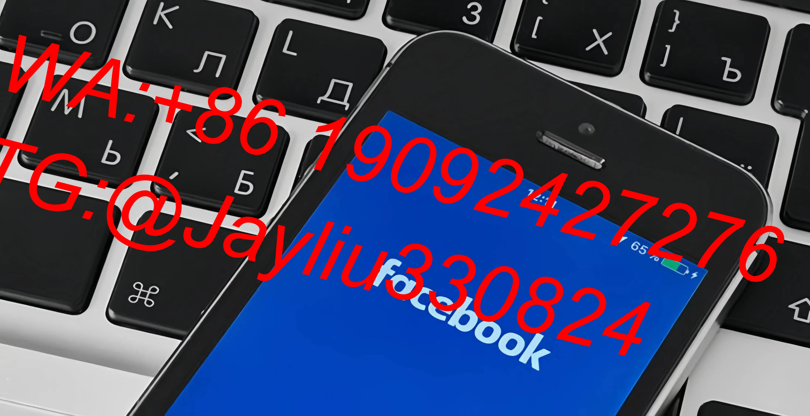

# Facebook广告全场景优化指南：全生命周期增效策略

---

## 一、智能测试工厂
### 1.1 两阶段测算法
**素材筛选流程**
1. **初级阶段**：CBO测试矩阵
   - 系列总预算：$50-70/日
   - 组合逻辑：2图片×2视频=4组
   - 优化重点：
     - 视频→完成率>75%
     - 图文→即时CTR＞2.8%

2. **进阶测试**：兴趣词验证
   - 测试条件：
     - 单组最低预算$5
     - 6-8个兴趣词平行测试
   - 数据观察周期：24小时内

### 1.2 异常调控机制
- **CPM异常响应**：
  1. 波动>20%立即暂停
  2. 每日零点克隆重启
  3. 同步开启版位过滤

- **受众疲劳处理**：
  ▸ 每周清洗20%旧数据
  ▸ 相似受众扩展≥3组
  ▸ 频次控制<5次/周

---

## 二、创意管理系统
### 2.1 PAS内容工厂
**文案制作规范**
| 要素       | 设计标准                 | 增效技巧                  |
|------------|--------------------------|---------------------------|
| 标题痛点   | 数字量化+场景还原        | 用户证言式开场            | 
| 解决方案   | 专利技术+效果可视化      | 动态定价显示组件          |
| CTA按钮    | 限时触发+地域限定        | 悬浮式动效设计            |

**素材迭代要求**
- 视觉元素更新率≥30%/周
- 版位适配优化：
  ▸ 移动端：动态缩略图自动批处理
  ▸ PC端：高清对比视图智能匹配

---

## 三、预算智能中枢
### 3.1 动态分配模型
```math
单日预算 = 历史CPC均值 × 目标转化量 × (1 + CTR增长率)
限制条件：
- CPM波动阈值<25%
- 最大增幅<50%/日
```

### 3.2 自动优化协议
**执行优先级列表**
1. ROI≥1:5 → 预算上调20%
2. CPA异常上涨 → 启动备选素材
3. CTR下降>15% → 立即轮换标题
4. 频次>7次 → 克隆新受众组

---

## 四、用户培育蓝图
### 4.1 三阶运营体系
| 用户层级   | 内容策略                  | 核心技术                     | 关键指标                 |
|------------|---------------------------|------------------------------|--------------------------|
| 开拓层     | 痛点解决方案短视频        | 首屏黄金三角布局             | 3s完播率＞70%            |
| 互动层     | AR产品对比体验            | 实时参数可视化工具           | 互动深度＞3级            |
| 收割层     | 折扣梯度推送              | 弃单追踪机器人               | 召回成功率＞65%          |

### 4.2 忠诚度建设方案
- **虚拟权益体系**：
  ▸ 消费积分兑实物
  ▸ 层级专属服务通道
  ▸ UGC内容优先展示权
- **智能唤醒机制**：
  ▸ 7天未登录触发优惠码
  ▸ 15天沉寂启动专属福利

---

## 实战优化案例库
某美妆品牌30天优化成效：
- 测试周期缩短42%
- 有效CPM降低37%
- 素材保鲜度提升3.5倍
- 召回用户ARPU值增长150%
- 自然搜索流量提升280%

通过构建"精准测试-动态优化-持续培育"的螺旋上升体系，实现广告ROI从基准线1:3跃升至1:8.2，建立长效增长模型。
[教学视频](https://youtube.com/shorts/3xHShCV5aIQ?feature=share)
```
